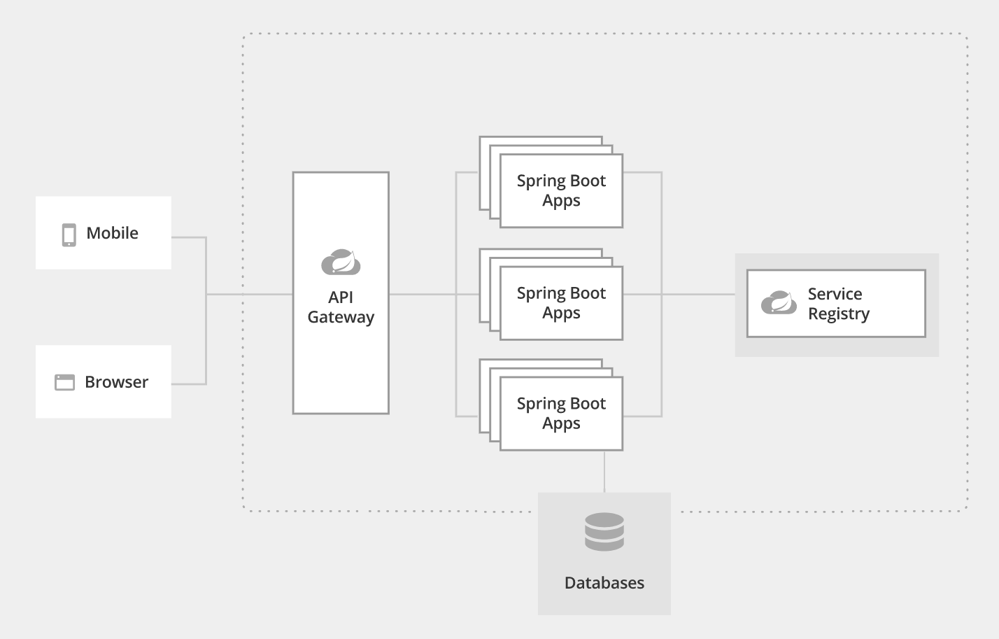

# Desafio Donus backend

## Conteúdo

- [Introdução](#introdução)
- [Arquitetura](#arquitetura)
- [Ambiente de Desenvolvimento e Tecnologias](#ambiente-de-desenvolvimento-e-tecnologias)
- [Execução](#execução)
- [Melhorias](#melhorias)


## Introdução

Para solucionar o problema foi desenvolvido uma arquitetura de micro serviços utilizando Spring Boot.

O Foco da aplicação é manter conta de clientes e as transações como deposito, retiradas e transferências.

## Arquitetura

A Arquitetura da aplicação é compostar por:
- AccountService (Responsável por manter contas e clientes)
- TransactionService (Responsável por manter as transações e saldo)

Segue um esboço da arquitetura proposta:



Arquitetura é composta por um API Gateway, responsável por centralizar as chamadas rest em uma única porta http://localhost:8080, pelo seus spring boot apps (AccountService e TransactionService) como mencionado anteriomente.
Por um Service Registry que foi utilizado o consul para registro e controle dos micro serviços e os bancos de dados PostgresSql e MongoDB.

## Ambiente de Desenvolvimento e Tecnologias
- Windows 10 Pro, Intel Core i7 - 16Gb Ram
- IntelliJ IDEA
- Java 8
- Spring Boot
- Docker
- docker-compose
- Maven
- PostgresSQL
- MongoDB
- JUnit
- OpenAPI (Documentação API REST)

## Execução

Para executar a aplicação dever ter em seu ambiente o Java 8, Docker e docker composer e executar o seguinte comando para subir os containers necessários:

Na raiz do projeto execute o comando:
```sh
docker-compose.exe -f docker-compose.yaml up -d --build
```

Endereços:
- Consul http://localhost:8500
- Api Gateway http://localhost:8080
  - http://localhost:8080/account (AccountService)
  - http://localhost:8080/transaction (TransactionService)
- Account Service - http://localhost:7001 (http://localhost:7001/swagger-ui/index.html?configUrl=/v3/api-docs/swagger-config)
- Transaction Service - http://localhost:7002 (http://localhost:7002/swagger-ui/index.html?configUrl=/v3/api-docs/swagger-config)
- PostgreSQL localhost:5432
- PgAdmin4 http://localhost:16543 (user: root@email.com pass: s3cr3t)
- MongoDB localhost:27017

## Melhorias
Balanceamento de carga para otimizar a utilização de recursos, maximizar o desempenho, minimizar o tempo de resposta e evitar sobrecarga caso haja uma grande quantidade de requisições aos serviços.

Spring Secutiry - Implementar segurança nos endpoints da api para que apenas aplicações autorizadas possam consumir os serviços.
